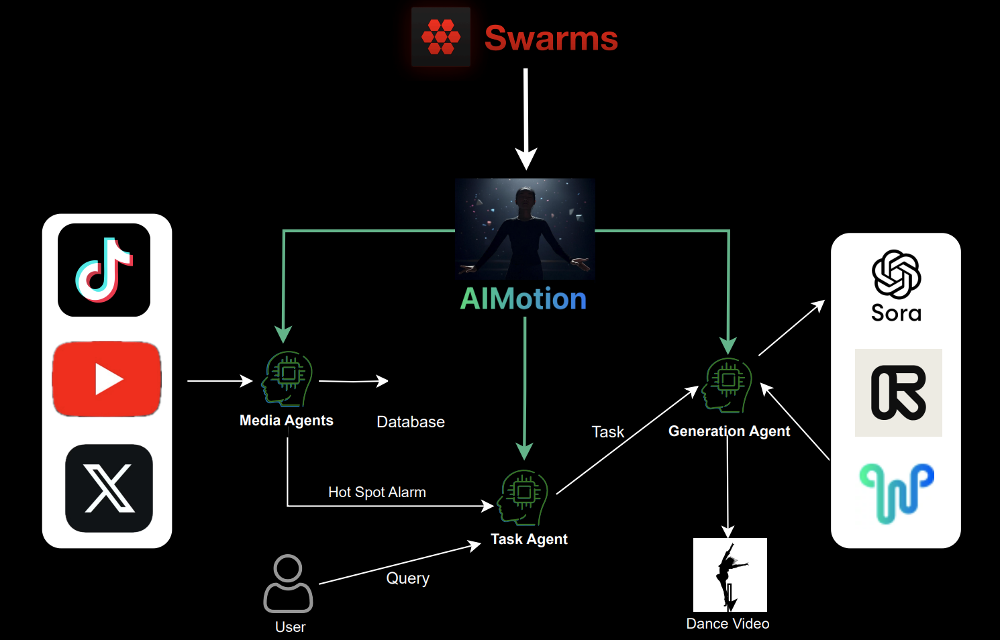

# AIMotion

The AIMotion project from Pump Dance is a collection of AI agents to generate funny and interesting video content.

## Architecture

AIMotion is built on top of the Swarms framework. 

+ [x] Generation agents are responsible for generating video content based on the saved content by autonomously selecting suitable content and generation techniques.
+ [TODO] Media agents are responsible for monitoring social media platforms to save and learn interesting content.
+ [TODO] Task agent is the front end to interact with the user and generate tasks for the generation agents. It also integrates with the media agents to get the hot spot topics on social media and generate tasks based on that.

## Environment Setup

1. Install dependencies: `
pip install -r requirements.txt
`

2. Rename `.env.example` to `.env` and fill in the missing values.

3. Configure `chromadb` database.
    1. Open a terminal and run `chroma run --path /db_path` to start the chromadb server.
    2. Create collections `dance_videos` and `token_images`.
    3. Insert some data into the collections. An example is provided in `database.py`.
Example code to insert data into the collections is provided in `database.py`.

4. Install `redis` server: `sudo apt-get install redis-server`

